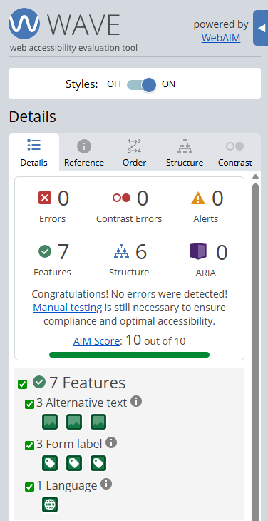
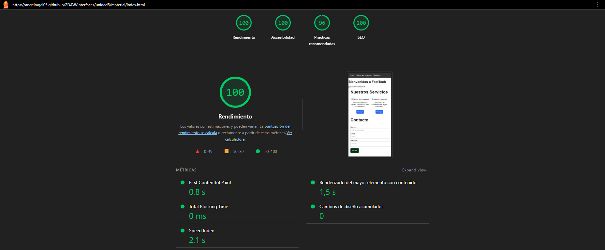

# Informe de Auditoría de Accesibilidad y SEO - FastTech

## 1. Datos Generales
- **Proyecto:** Web FastTech  
- **Fecha:** 22/01/2026  
- **Herramientas utilizadas:** Lighthouse (Chrome), WAVE Extension  

---

## 2. Puntuación Inicial (Antes de cambios)

| Área | Puntuación |
|------|------------|
| Accesibilidad | 56 / 100 |
| SEO | 82 / 100 |

**Problemas detectados:**
- Menú hecho con `
` y `onclick` → no accesible con teclado.  
- Botones falsos (`div`) → no activables con teclado ni lectores de pantalla.  
- Inputs y textarea sin `label` → lectores de pantalla no entienden los campos.  
- Imágenes sin `alt` → contenido perdido para personas con discapacidad visual.  
- Contraste de color insuficiente → texto gris sobre fondo oscuro.  
- Jerarquía de encabezados incorrecta → `
` en lugar de `<h2>` o `<h3>` → mal SEO.  

---

## 3. Principales errores críticos

| Error | Principio (POUR) | Criterio WCAG 2.1 | Prioridad |
|-------|-----------------|------------------|-----------|
| Menú no accesible con teclado | Operable | 2.1.1 | Alta |
| Botones falsos (`div`) | Operable | 4.1.2 | Alta |
| Inputs sin `label` | Comprensible | 3.3.2 | Alta |
| Imágenes sin `alt` | Perceptible | 1.1.1 | Media |
| Contraste bajo en texto de menú | Perceptible | 1.4.3 | Media |
| Encabezados fuera de orden jerárquico | Comprensible | 2.4.6 | Baja |

---

## 4. Priorización de correcciones

1. Formularios y botones interactivos → permitir interacción completa con teclado y lectores de pantalla.  
2. Menú y navegación → enfoque visible y tabulación.  
3. Contraste de color → legibilidad del texto.  
4. Imágenes con `alt` → accesibilidad visual y SEO.  
5. Jerarquía de encabezados → estructura semántica y SEO.

---

## 5. Acciones realizadas (Después de cambios)

- Reemplazo de `
` por etiquetas semánticas: `<header>`, `<nav>`, `<section>`, `<article>`.  
- Botones falsos convertidos en `<button>` con foco visible.  
- Inputs y textarea con etiquetas `<label>` asociadas correctamente.  
- Imágenes con `alt` descriptivo para contenido visual.  
- Contraste de color corregido: texto oscuro sobre fondo claro, botones accesibles.  
- Metadatos SEO añadidos: `<title>`, `<meta name="description">`.  
- Jerarquía de encabezados corregida: `<h1>` para la página, `<h2>` para secciones.  

---

## 6. Puntuación Final (Después de cambios)

| Área | Puntuación |
|------|------------|
| Accesibilidad | 100 / 100 |
| SEO | 100 / 100 |

> Capturas de pantalla de Lighthouse y WAVE aquí:  
>   
> 

---

## 7. Conclusión

Con las modificaciones realizadas, la web cumple con los criterios de accesibilidad y SEO recomendados por WCAG 2.1 y las mejores prácticas de desarrollo web, mejorando la experiencia de usuarios con discapacidad y la visibilidad en buscadores.  

