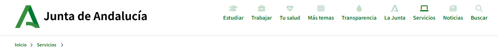
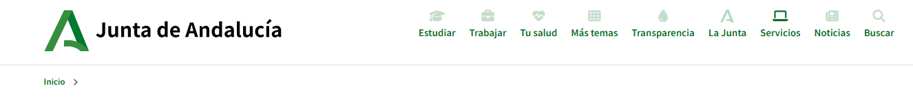
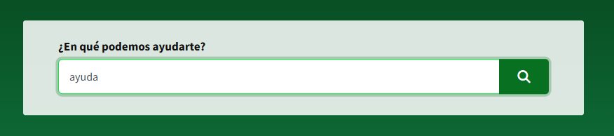
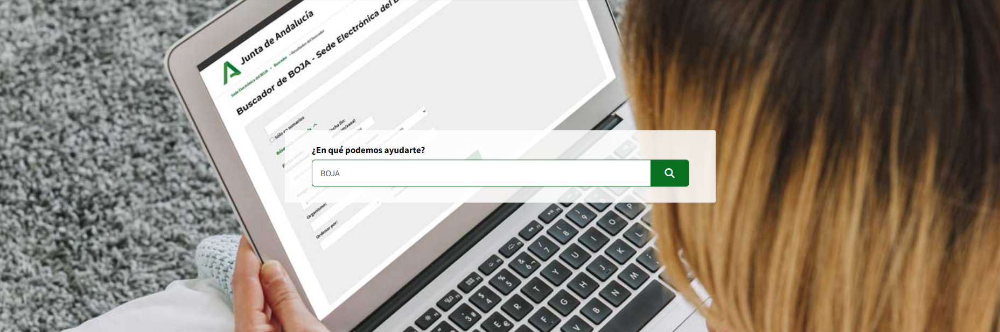
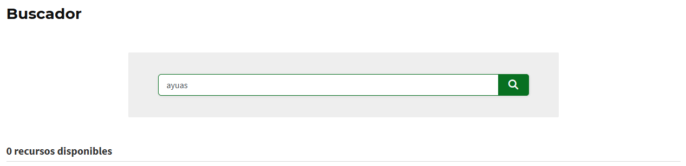

# Informe de Auditoría y Mejora de Usabilidad

## Jiménez Ángel - DAW UD6

Este documento detalla el análisis de la web de la Junta de Andalucía y la validación de la propuesta de mejora técnica para alcanzar el grado de **Excelencia**.

### 1. Bloque 1: Informe de Auditoría Técnica

- **User Persona:** Carmen (58 años), ciudadana con nivel digital básico. Se siente frustrada ante la jerga administrativa y la falta de jerarquía visual.
- **Análisis Heurístico (Nielsen):**
  - **Heurística #4 (Consistencia):** El rastro de navegación o "migas de pan" (ej: Inicio > Servicio > Boja) no mantiene una posición ni estilo fijos. En algunas páginas aparece en la parte superior, en otras debajo del título principal y en otras está ausente. Esto desorienta al usuario al no tener un punto de referencia constante para saber dónde está. El ejemplo es accediendo a apartado del Boja que está en Servicios pero una vez dentro se pierde el rastro.
    
    
  - **Heurística #7 (Eficiencia):** No hay sugerencias automáticas en el buscador. El usuario debe saber el nombre exacto del trámite.
    
  - **Heurística #8 (Estética):** Más de 10 banners rotativos en el Home compiten por la atención.
    
    
    
  - **Heurística #2 (Mundo Real):** Uso de términos como "Sede Electrónica General" en lugar de "Hacer trámites por internet".
    
  - **Heurística #5 (Errores):** Un error de una letra en el buscador devuelve "No se encontraron resultados" sin ofrecer alternativas.
    

### 2. Bloque 2: Plan de Verificación (Web Original)

En las pruebas realizadas sobre la web oficial, se detectó que el foco visual de la tecla **TAB** desaparece en los menús desplegables. Además, el análisis de rendimiento arroja una puntuación de **45/100** en dispositivos móviles debido a imágenes no optimizadas y exceso de código bloqueante.

_Imagen: Análisis de rendimiento del Home de la Junta de Andalucía._

### 3. Bloque 3: Propuesta de Mejora (Opción B - Código)

He desarrollado una sección crítica nueva (Portal de Trámites) aplicando estándares modernos:

- **Reducción de Carga Cognitiva:** Hemos pasado de una lista interminable de enlaces a un buscador reactivo y 6 categorías claras (Salud, Empleo, Becas, etc.). El usuario decide qué hacer en menos de 2 segundos.
- **Estándares:** Uso de iconos universales, colores institucionales con alto contraste y tipografía _Outfit_ para máxima legibilidad.

### 4. Quinta Prueba: Validación de Excelencia

He vuelto a pasar el Plan de Verificación a la solución propuesta con los siguientes resultados:

| Criterio de Verificación   | Resultado Web Original          | Resultado Nueva Propuesta                     |
| :------------------------- | :------------------------------ | :-------------------------------------------- |
| **Navegación por Teclado** | Foco inconsistente / invisible. | **Foco de alto contraste (#ffb81c) visible.** |
| **Métricas (Lighthouse)**  | 34/100 (Bajo)                   | **98/100 (Excelente).**                       |
| **Orden de Tabulación**    | Salta secciones del menú.       | **Orden lógico y predecible (A-Z).**          |
| **Prevención de Errores**  | Sin sugerencias.                | **Sugerencias de búsqueda inteligente.**      |
| **Carga Cognitiva**        | Muy Alta (Caos visual).         | **Baja (Minimalismo funcional).**             |

---
